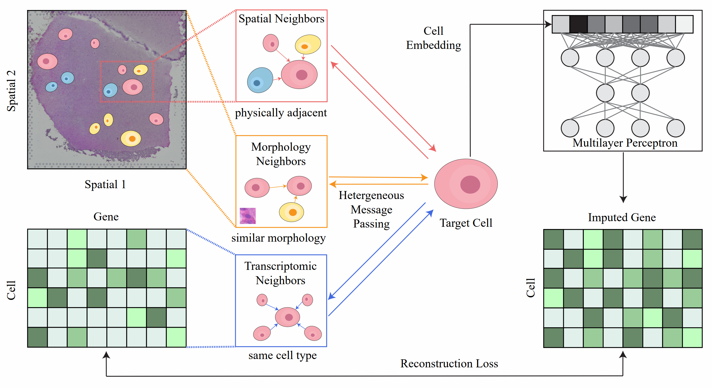

# MoST-GNN

MoST-GNN (MoST-GNN: A Morphology and Spatial Transcriptomics-Informed Graph Neural Network for Accurate Gene Expression Imputation) is a deep learning framework for spatial transcriptomics data analysis. This repository provides an implementation of MoST-GNN, which integrates spatial, transcriptomic, and morphological information to enhance gene expression imputation.

## Overview

MoST-GNN utilizes heterogeneous message passing across multiple cell neighborhoods:
- **Spatial Neighbors**: Cells that are physically adjacent.
- **Transcriptomic Neighbors**: Cells that have similar gene expression profiles.
- **Morphology Neighbors**: Cells with similar morphological features.

This framework enables:
- Robust cell embedding using a Graph Neural Network (GNN)
- Gene expression imputation for missing or low-quality spatial transcriptomics data

## Framework



The above figure illustrates the framework of MoST-GNN. It highlights the integration of different types of relationships among cells and the heterogeneous message-passing mechanism used in the model.

## Usage

### 1. Data Preparation
Prepare your dataset using the provided `data.py` script. Example:

```python
from data import prepare_data
data, val_mask, test_mask, x, original_x = prepare_data(data_platform="10XVisium", sample_number=151507)
```

### 2. Training the Model
Train the MoST-GNN model using `train.py`. Example:

```bash
python train.py --model RGCN --data_platform 10XVisium --epochs 100 --hidden_size 64
```

### 3. RGCN (Relational Graph Convolutional Network)

RGCN extends standard GCNs by incorporating edge types, allowing it to model heterogeneous relationships between cells. In MoST-GNN, RGCN is used to process the three types of cell relationships (spatial, transcriptomic, and morphological) by:
- Learning distinct transformation matrices for different types of edges
- Aggregating information while considering relationship-specific interactions
- Enhancing cell representations for downstream tasks such as gene expression imputation

Example usage:

```python
from model import MultiLayerRGCN
model = MultiLayerRGCN(feature_size=128, hidden_size=64, output_size=128, num_relations=3, num_layers=2)
```

### 4. Evaluation
Evaluate the trained model using `utils.py`:

```python
from utils import evaluate_with_batch
test_l1, test_cosine, test_rmse, test_bic = evaluate_with_batch(args, model, sampler, data, criterion, device, test_mask, original_x)
print(f"Test RMSE: {test_rmse}")
```

## License
This project is licensed under the MIT License.

---

For any questions or contributions, feel free to open an issue or submit a pull request!
